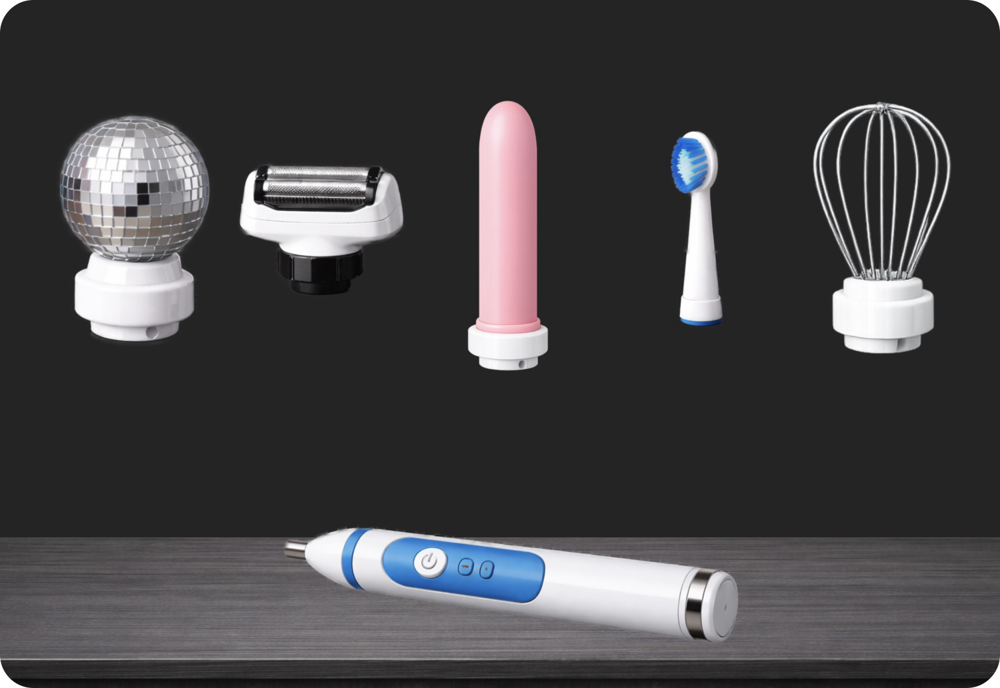

# BRUSH (WIP)

I was fascinated to see how with LLMs we have an elegant solution and now searching for problems to apply the solution to, because of hype. It's only a matter of time until we have AI-powered toothbrushes. The HYPE is on. I wanted to apply the idea to physical goods and played around with the idea of having an elegant solution (an electric toothbrush) and using it to solve every conceivable problem. The outcome is a fictive startup. Stay tuned for updates.



## Getting Started

- Tech stack: React 19, TypeScript 5.9, Vite 7, GSAP 3
- Prerequisites: Node.js 18+, npm or yarn

### Installation

```bash
npm install
```

### Development

Start the Vite dev server with hot module replacement:

```bash
npm run dev
```

The app will be available at `http://localhost:5173` by default.

### Build

Compile TypeScript and build optimized production bundle:

```bash
npm run build
```

Output goes to the `dist/` directory.

### Preview

Preview the production build locally:

```bash
npm run preview
```

### Linting

Check code quality:

```bash
npm run lint
```
